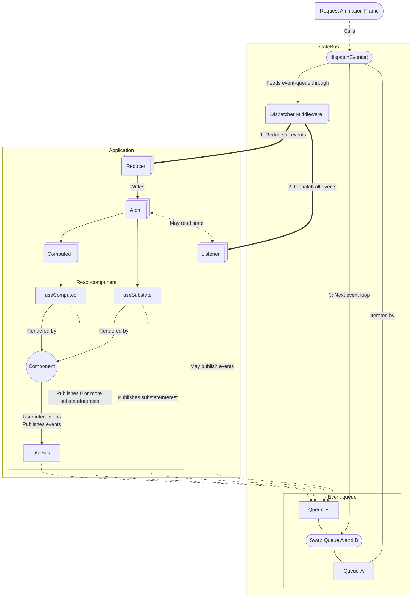

# StateBus 🚎 Event-based state management

Uncoupling event handling, data fetching, logic and interactions from UI components.

StateBus is a JavaScript library for event-driven global state management. It provides a **_fully-typed_** global event
bus with per-topic and event-type reducers, allowing for a flexible and scalable state architecture. Powered by
[Signia](https://signia.tldraw.dev/docs/what-are-signals), StateBus ensures efficient state updates and reactivity, with
seamless React and React Native integration for rendering state in components.

## Installation

1. Install StateBus via npm or bun:

```bash
npm install @smoothbricks/statebus
```

2. Declare your application `States` and `Events` definitions in a `statebus.d.ts` file:

```typescript
// statebus.d.ts
declare module '@smoothbricks/statebus' {
  // State keys and their value types
  interface States {
    // - here a single state key `counter` with a number value
    counter: number;
  }

  // Topic name(s) and their event types and payloads
  interface Events {
    // - here a single topic named `count`
    count: {
      // Event types and their payloads
      increment: number;
      decrement: number;
    };
  }
}
```

3. Add the following to your `tsconfig.json`:

```json
"types": ["./statebus"]
```

## Documentation

Documentation is available at [smoothbricks.dev/statebus](https://smoothbricks.dev/statebus), including guides and API
references to help you integrate StateBus into your projects.

## Basic Example

StateBus revolves around a application-wide event bus that manages state changes through events and reducers. Events
(commands, queries, mutations, ...) are dispatched by the bus and applied to application state by reducers, after which
Event listeners can react to the events and read the updated state.

Here's a simple example:

```typescript
import { useBus, useSubstate } from '@smoothbricks/statebus/react';
// This example uses the StateBus definition file created in the installation section

// Create a global StateBus event bus
const eventBus = new StateBus({
  // Initial state:
  state: {
    counter: 0,
  },
  // Flexible per-topic and per-event-type reducer setup:
  // (see documentation for more details)
  reducers: {
    count: {
      increment: (state, payload) => ({ count: state.count + payload }),
      decrement: (state, payload) => ({ count: state.count - payload }),
    },
  },
});

// Use StateBus in a React component
function Counter() {
  const bus = useBus();
  const count = useSubstate('counter');

  return (
    <div>
      <p>Count: {count}</p>
      <button onClick={() => bus.count.increment(1)}>Increment by 1</button>
      <button onClick={() => bus.count.decrement(9)}>Decrement by 9</button>
    </div>
  );
}

// Setup the app with the configured event bus
function App() {
  return (
    <StateBusProvider bus={eventBus}>
      <Counter />
    </StateBusProvider>
  );
}
```

## Architecture diagram

StateBus is explicitly designed to make the easy way, the best way. The diagram below illustrates how events travel
through the bus, and how it integrates with React.

When an event is published, it is added to a queue, and processed by (optional) middleware before being dispatched to
reducers.

Only 1 reducer is allowed per event type. Reducers can only write to state, but not publish events. After all reducers
have processed the queue, and possibly updated state, listeners are notified for the same events.

Multiple listeners can be registered for an event type. Listeners can publish their own events, which will be processed
in the next iteration after all other listeners have been notified.



## Advanced Usage

Explore advanced features such as:

- **Application-wide Event Bus**: Centralize your state management with a flexible event bus.
- **Signia Integration**: Efficient state updates and derived computations.
- **React Integration**: Easily integrate with React to render state in your components.

For more detailed examples and advanced usage, refer to our [documentation](https://smoothbricks.dev/statebus).

## Community and Support

For questions, issues, or contributions, please open a GitHub issue in our repository. We welcome feedback and
contributions from the community.

## License

StateBus is licensed under the MIT License.

---

StateBus is designed to provide a robust and flexible state management solution. Whether you're building a small app or
a large-scale application, StateBus can help you manage your state efficiently and effectively.
